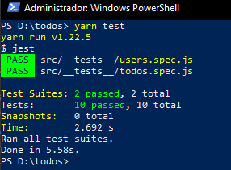

# Desafio 1 do Ignite Trilha NodeJS

<h3 align="center">
  Desafio 01: Conceitos do Node.js
</h3>

  

  

  

## :rocket: Sobre o desafio

Nesse desafio, foi criada uma aplicação backend para treinar o que aprendi até agora no Node.js!

É uma aplicação para gerenciar tarefas (em inglês *todos*). Será permitida a criação de um usuário com `name` e `username`, bem como fazer o CRUD de *todos*:

- Criar um novo *todo*;
- Listar todos os *todos*;
- Alterar o `title` e `deadline` de um *todo* existente;
- Marcar um *todo* como feito;
- Excluir um *todo*;

Tudo isso para cada usuário em específico (o `username` será passado pelo header).

## Resultado dos testes

## :memo: Licença

Esse projeto está sob a licença MIT. Veja o arquivo [LICENSE](https://github.com/git/git-scm.com/blob/master/MIT-LICENSE.txt) para mais detalhes.

---

Feito com 💜 by <a href="https://www.linkedin.com/in/felipe-guimar%C3%A3es-046837208/">Felipe Guimarães</a> :wave: